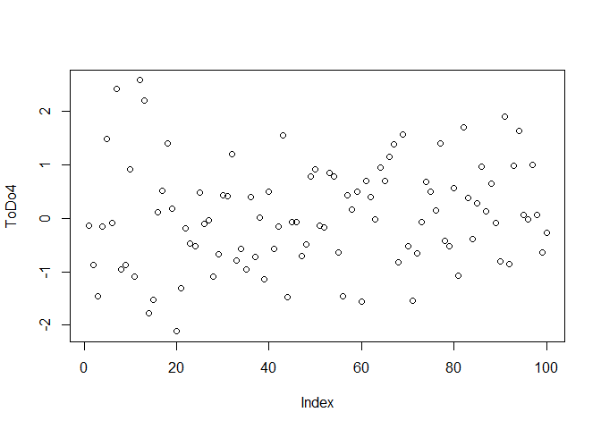
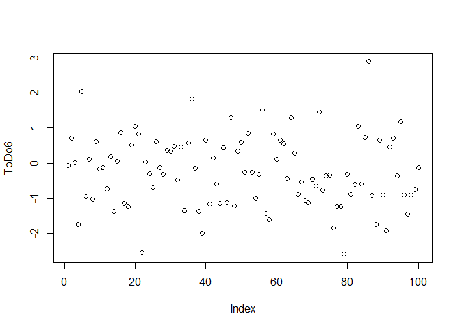
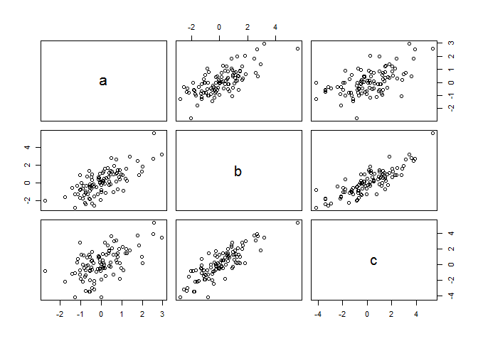
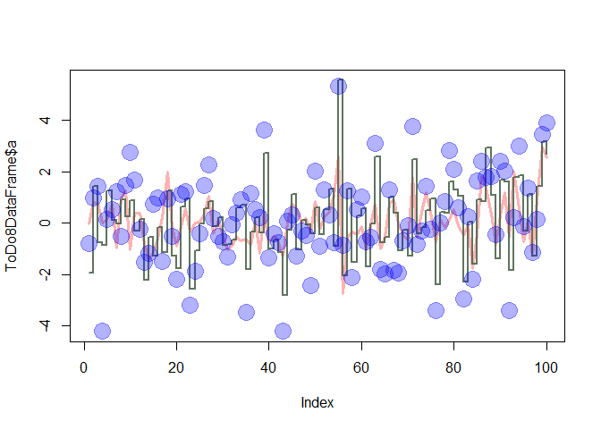
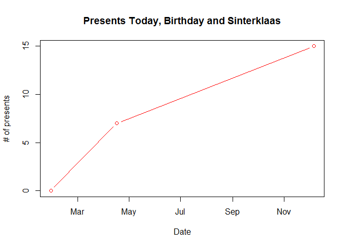

SRT411A0
================
Connor Brozic
February 1, 2017

### Intro

Hello, this is Assignment 0 for SRT411. This was written by Connor Brozic.

Github Username: ConnorBrozic

This assigment focuses on completing the 15 "ToDos" from within the "A (very) short introduction to R"", written by Paul Torfs and Claudia Brauer. It focuses on the basics of the R languages, to showcase how powerful even a basic part of R is.
This document can be found at: <https://cran.r-project.org/doc/contrib/Torfs+Brauer-Short-R-Intro.pdf>

I have used help sources in some cases, which i have outlined at the bottom of this document.

#### ToDo Question 1

Compute the difference between 2014 and the year you started at this university and divide this by the difference between 2014 and the year you were born. Multiply this with 100 to get the percentage of your life you have spent at this university.

``` r
#Modifications changed to keep dates current
((2017-2015)/(2017-1997))*100
```

    ## [1] 10

#### ToDo Question 2

Repeat the previous ToDo, but with several steps in between. You can give the variables any name you want, but the name has to start with a letter.

``` r
CurrentMinusStarting <- 2017-2015
CurrentMinusBirth <- 2017-1997
DecimalofLife <- CurrentMinusStarting/CurrentMinusBirth
PercentofLife <- DecimalofLife * 100
PercentofLife
```

    ## [1] 10

#### ToDo Question 3

Compute the sum of 4, 5, 8 and 11 by first combining them into a vector and then using the function sum.

``` r
sum(ToDo3 <- c(4,5,8,11))
```

    ## [1] 28

#### ToDo Question 4

Plot 100 normal random numbers.

``` r
ToDo4 <- rnorm(100)
plot(ToDo4)
```



#### ToDo Question 5

Find help for the sqrt function.

``` r
help(sqrt)
```

    ## starting httpd help server ...

    ##  done

#### ToDo Question 6

Make a file called firstscript.R containing Rcode that generates 100 random numbers and plots them.

``` r
ToDo6 <- rnorm(100)
plot(ToDo6)
```



#### ToDo Question 7

Put the numbers 31 to 60 in a vector named P and in a matrix with 6 rows and 5 columns named Q.

``` r
P <- c(31:60)
Q <- matrix(data=P, nrow = 6, ncol = 5)
Q
```

    ##      [,1] [,2] [,3] [,4] [,5]
    ## [1,]   31   37   43   49   55
    ## [2,]   32   38   44   50   56
    ## [3,]   33   39   45   51   57
    ## [4,]   34   40   46   52   58
    ## [5,]   35   41   47   53   59
    ## [6,]   36   42   48   54   60

#### ToDo Question 8

Make a script file which constructs three random normal vectors of length 100. Call these vectors x1, x2 and x3. Make a data frame called t with three columns (called a, b and c) containing respectively x1, x1+x2 and x1+x2+x3. Call the following functions for this data frame: plot(t) and sd(t).

``` r
x1 <- c(rnorm(100))
x2 <- c(rnorm(100))
x3 <- c(rnorm(100))
ToDo8DataFrame = data.frame(a = x1, b = x1+x2, c = x1+x2+x3)
plot(ToDo8DataFrame) #Works no problem and plots the results.
```



``` r
#sd(t) #Does not work as lists cannot be converted to double. 
```

#### ToDo Question 9

Add these lines to the script file of the previous section. Try to find out, either by experimenting or by using the help, what the meaning is of rgb, the last argument of rgb, lwd, pch, cex.

``` r
plot(ToDo8DataFrame$a, type = "l", ylim = range(ToDo8DataFrame), lwd = 3, col=rgb(1,0,0,0.3))
lines(ToDo8DataFrame$b, type = "s", lwd = 2, col = rgb(0.3,0.4,0.3,0.9))
points(ToDo8DataFrame$c, pch = 20, cex = 4, col = rgb(0,0,1,0.3))
```



``` r
#Answer to RGB Question:  the RGB argument specifies which colour to use for the specified plot
#Takes four numbers, Red, green, blue and alpha. 
#Alpha controls opacity of the element
```

#### ToDo Question 10

Make a file called tst1.txt in Notepad from the example in Figure 4 and store it in your working directory. Write a script to read it, to multiply the column called g by 5 and to store it as tst2.txt.

``` r
ToDo11 <- read.table(file="tst1.txt", header = TRUE)
ToDo11$g <- ToDo11$g * 5
ToDo11
```

    ##    a   g  x
    ## 1  1  10  3
    ## 2  2  20  6
    ## 3  4  40 12
    ## 4  8  80 24
    ## 5 16 160 48
    ## 6 32 320 96

``` r
write.table(ToDo11,file = "tst2.txt", row.names = TRUE)
```

#### ToDo Question 11

Compute the mean of the square root of a vector of 100 random numbers. What happens?

``` r
ToDo10 <- mean(sqrt(c(rnorm(100))))
```

    ## Warning in sqrt(c(rnorm(100))): NaNs produced

``` r
#This calculation does not work, results in NaNs being produced as an output.  
```

#### ToDo Question 12

Make a graph with on the x-axis: today, Sinterklaas 2014 and your next birthday and on the y-axis the number of presents you expect on each of these days.

``` r
xAxis <- strptime(c("20170128", "20170416", "20171206"), format = "%Y%m%d")
yAxis <- c(0, 7,15)
plot(xAxis, yAxis, type = "b", col="Red", ylab="# of presents", xlab ="Date", main = "Presents Today, Birthday and Sinterklaas")
```



#### ToDo Question 13

Make a vector from 1 to 100. Make a for-loop which runs through the whole vector. Multiply the elements which are smaller than 5 and larger than 90 with 10 and the other elements with 0.1.

``` r
ToDo13 <- seq(from = 1, to = 100)
ToDo13a <- c()
for(i in ToDo13)
  {
  if (i < 5)
  {
    ToDo13a[i]= ToDo13[i] * 10
  }else if (i > 90){
    ToDo13a[i]= ToDo13[i] * 10
  }else{
    ToDo13a[i] = ToDo13[i] * 0.1
  }
}
ToDo13a
```

    ##   [1]   10.0   20.0   30.0   40.0    0.5    0.6    0.7    0.8    0.9    1.0
    ##  [11]    1.1    1.2    1.3    1.4    1.5    1.6    1.7    1.8    1.9    2.0
    ##  [21]    2.1    2.2    2.3    2.4    2.5    2.6    2.7    2.8    2.9    3.0
    ##  [31]    3.1    3.2    3.3    3.4    3.5    3.6    3.7    3.8    3.9    4.0
    ##  [41]    4.1    4.2    4.3    4.4    4.5    4.6    4.7    4.8    4.9    5.0
    ##  [51]    5.1    5.2    5.3    5.4    5.5    5.6    5.7    5.8    5.9    6.0
    ##  [61]    6.1    6.2    6.3    6.4    6.5    6.6    6.7    6.8    6.9    7.0
    ##  [71]    7.1    7.2    7.3    7.4    7.5    7.6    7.7    7.8    7.9    8.0
    ##  [81]    8.1    8.2    8.3    8.4    8.5    8.6    8.7    8.8    8.9    9.0
    ##  [91]  910.0  920.0  930.0  940.0  950.0  960.0  970.0  980.0  990.0 1000.0

#### ToDo Question 14

Write a function for the previous ToDo, so that you can feed it any vector you like (as argument). Use a for-loop in the function to do the computation with each element. Use the standard R function length in the specification of the counter

``` r
ToDo14Function <- function(arg1)
  {
  arg1length <<- length(arg1)
  for(i in 1:arg1length)
    {
    if (arg1[i] < 5)
      {
      arg1[i]= arg1[i] * 10
      }
    else if (arg1[i] > 90){
      arg1[i]= arg1[i] * 10
    }else{
      arg1[i] = arg1[i] * 0.1
    }
  }
  return(arg1)
}
test <- c(1:100)
ToDo14Function(arg1 = test)
```

    ##   [1]   10.0   20.0   30.0   40.0    0.5    0.6    0.7    0.8    0.9    1.0
    ##  [11]    1.1    1.2    1.3    1.4    1.5    1.6    1.7    1.8    1.9    2.0
    ##  [21]    2.1    2.2    2.3    2.4    2.5    2.6    2.7    2.8    2.9    3.0
    ##  [31]    3.1    3.2    3.3    3.4    3.5    3.6    3.7    3.8    3.9    4.0
    ##  [41]    4.1    4.2    4.3    4.4    4.5    4.6    4.7    4.8    4.9    5.0
    ##  [51]    5.1    5.2    5.3    5.4    5.5    5.6    5.7    5.8    5.9    6.0
    ##  [61]    6.1    6.2    6.3    6.4    6.5    6.6    6.7    6.8    6.9    7.0
    ##  [71]    7.1    7.2    7.3    7.4    7.5    7.6    7.7    7.8    7.9    8.0
    ##  [81]    8.1    8.2    8.3    8.4    8.5    8.6    8.7    8.8    8.9    9.0
    ##  [91]  910.0  920.0  930.0  940.0  950.0  960.0  970.0  980.0  990.0 1000.0

#### ToDo Question 15

The ToDo above can be done more easily and quickly without a for-loop but with regular vector-computations.

``` r
ToDo15 <- c(1:100)
Result1 <- ToDo15[ToDo15<5] * 10
Result2 <- ToDo15[ToDo15>=5 & ToDo15<=90] * 0.1
Result3 <- ToDo15[ToDo15>90] * 10
ToDo15 <- c(Result1,Result2,Result3)
ToDo15
```

    ##   [1]   10.0   20.0   30.0   40.0    0.5    0.6    0.7    0.8    0.9    1.0
    ##  [11]    1.1    1.2    1.3    1.4    1.5    1.6    1.7    1.8    1.9    2.0
    ##  [21]    2.1    2.2    2.3    2.4    2.5    2.6    2.7    2.8    2.9    3.0
    ##  [31]    3.1    3.2    3.3    3.4    3.5    3.6    3.7    3.8    3.9    4.0
    ##  [41]    4.1    4.2    4.3    4.4    4.5    4.6    4.7    4.8    4.9    5.0
    ##  [51]    5.1    5.2    5.3    5.4    5.5    5.6    5.7    5.8    5.9    6.0
    ##  [61]    6.1    6.2    6.3    6.4    6.5    6.6    6.7    6.8    6.9    7.0
    ##  [71]    7.1    7.2    7.3    7.4    7.5    7.6    7.7    7.8    7.9    8.0
    ##  [81]    8.1    8.2    8.3    8.4    8.5    8.6    8.7    8.8    8.9    9.0
    ##  [91]  910.0  920.0  930.0  940.0  950.0  960.0  970.0  980.0  990.0 1000.0

#### Sources Used

-   <http://rmarkdown.rstudio.com/>
-   <https://nicercode.github.io/guides/reports/>
-   <http://kbroman.org/knitr_knutshell/pages/markdown.html>
-   <http://kbroman.org/knitr_knutshell/pages/Rmarkdown.html>
-   <https://www.rstudio.com/wp-content/uploads/2015/02/rmarkdown-cheatsheet.pdf>
-   <https://cran.r-project.org/doc/contrib/Torfs+Brauer-Short-R-Intro.pdf>
-   <https://therostrumblog.wordpress.com/2014/01/29/basic-data-frame-manipulations-in-r/>
-   <http://stackoverflow.com/questions/2564258/plot-two-graphs-in-same-plot-in-r>
-   <https://stat.ethz.ch/R-manual/R-devel/library/graphics/html/axis.POSIXct.html>
-   <http://stackoverflow.com/questions/1236620/global-variables-in-r>
